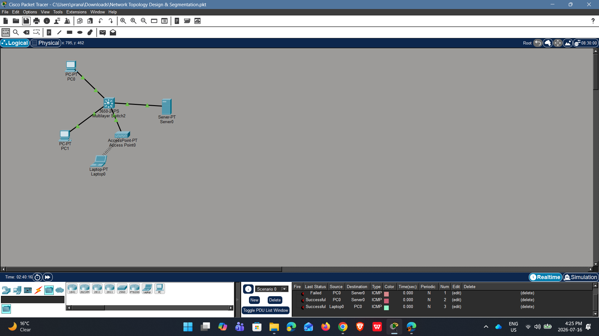

# Network Topology Design & Segmentation

## Objective
This project demonstrates the implementation of a 3-zone network topology using a Layer 3 switch. The goal was to achieve network segmentation to isolate user traffic, server traffic, and guest traffic while enabling controlled inter-VLAN routing.

## Topology Design


## Configuration Details
- **VLAN 10 (LAN Users)**: [192.168.10.0/24]
- **VLAN 20 (Servers)**: [192.168.20.0/24]
- **VLAN 30 (Guest/Wireless)**: [192.168.30.0/24]

### Key CLI Commands Used:
```bash
Step 1: Create the VLANs
Type these commands to create your three zones:

enable

configure terminal

vlan 10

name LAN_Users

exit

vlan 20

name Servers

exit

vlan 30

name Guest

exit

Step 2: Assign Ports to Zones
We will now assign your devices to their specific zones. Ensure your cables are plugged into the ports listed below:

interface gigabitEthernet 1/0/1 (PC0)

switchport mode access

switchport access vlan 10

exit

interface gigabitEthernet 1/0/2 (PC1)

switchport mode access

switchport access vlan 10

exit

interface gigabitEthernet 1/0/4 (Server0)

switchport mode access

switchport access vlan 20

exit

interface gigabitEthernet 1/0/3 (Access Point)

switchport mode access

switchport access vlan 30

exit

Step 3: Enable Routing & Configure Gateways
This step turns the switch into a router so the zones can communicate with each other:

ip routing

interface vlan 10

ip address 192.168.10.1 255.255.255.0

no shutdown

exit

interface vlan 20

ip address 192.168.20.1 255.255.255.0

no shutdown

exit

interface vlan 30

ip address 192.168.30.1 255.255.255.0

no shutdown

exit

Step 4: Configure End Device IP Addresses
For each device, click it, go to the Desktop tab, then IP Configuration:

PC0 (VLAN 10):

IP Address: 192.168.10.10

Subnet Mask: 255.255.255.0

Default Gateway: 192.168.10.1

PC1 (VLAN 10):

IP Address: 192.168.10.11

Subnet Mask: 255.255.255.0

Default Gateway: 192.168.10.1

Server0 (VLAN 20):

IP Address: 192.168.20.10

Subnet Mask: 255.255.255.0

Default Gateway: 192.168.20.1

Laptop (VLAN 30):

IP Address: 192.168.30.10

Subnet Mask: 255.255.255.0

Default Gateway: 192.168.30.1

```
# Testing & Validation
Tested intra-zone connectivity (PC to PC).

Tested inter-zone routing (PC to Server) using Packet Tracer’s PDU tool.

All tests returned Successful status.

### Future Scope
The next phase of this project will focus on hardening the network by implementing Access Control Lists (ACLs) to restrict traffic from the Guest zone to the Server zone, further reducing the network's attack surface.
